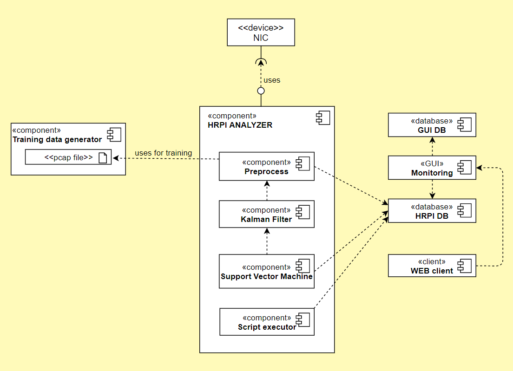
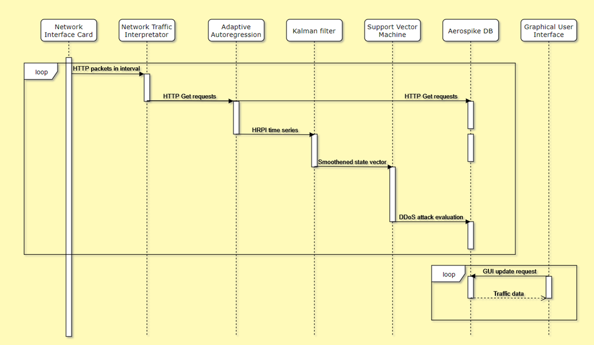

# Overview
The HRPI analyzer module detects application-layer DDoS attacks and effectively acts as one of the components of L7 firewall.
Using the mathematical approach in [1], this application can effectively detect attacks and run a set of according actions. The solution also provides easy to use graphical user interface with application’s traffic monitoring and attack notifications. The users of the monitoring system can also manipulate historical data.
This solution also consists of generating training data for machine learning approach used in detecting attacks and its testing.
# Idea
The idea behind this component is very well described with the followint picture: 

 

***
<b>Key functions:</b>
 
•	Application level DDoS attack detection. The solution detects bandwidth and resources exhausting traffic activity based on certain statistical features extracted by the model.
 
•	State monitoring. Analyzer features intuitive network traffic monitoring capabilities, attack alert system and previous state graphs.

# Operation
Basic operation of this module is best described with 2 diagrams: components view and runtime view.
 
***

 

 
• NIC – Network Interface Card – device with which the module directly communicates to get real time traffic data 
• Training data generator – program responsible for generating training data for the SVM classifier 
• Preprocess – algorithm to convert packet data from NIC to HRPI used by mathematical model 
• Kalman filter – algorithm to estimate current traffic’s state 
• Support Vector Machine – algorithm to classify the attack traffic from current state 
• Monitoring – WEB based graphical user interface to monitor current traffic and historical data 
• Script executor – program that starts predetermined script in case of an attack 
• GUI DB – Maria DB for storing GUI related information, such as logins 
• HRPI DB – Aerospike DB for storing real time traffic data 
• WEB client – application running of user’s browser

***
Runtime sequence diagram for a single time interval packet set evaluation:

<b>Program's logic is taken from the former article. </b>
